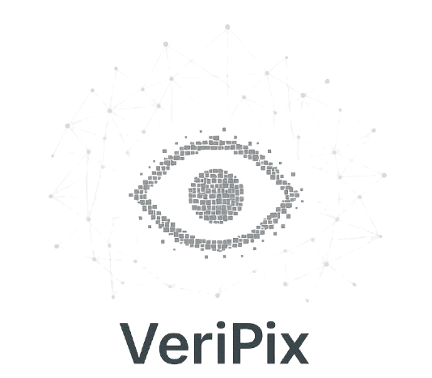

<p align="center">
  
</p>


# VeriPix – Vérificateur d'images réelle ou artificielle

VeriPix est un projet en Python dont l’objectif est d’acquérir, stocker, enrichir et analyser des images afin d’en extraire des caractéristiques visuelles (ELA, netteté, couleurs, etc.).  
Le pipeline permet ensuite d’exposer ces données via une API FastAPI.

---

## Fonctionnement

Le projet s’exécute avec le un script principal :

```
python main.py
```

Le scrip main.py lance automatiquement :

1. `creation_sqlite.py` → création 
2. `etl.py` → exécution du pipeline complet :

```
main.py
 ├── creation_sqlite.py      (création tables SQLite)
 └── etl.py
      ├── json_to_mongo2.py        (import depuis JSON → MongoDB)
      ├── scrap_artif.py           (scraping images artificielles)
      ├── api_reelle3.py           (API iNaturalist → images réelles)
      ├── sync_mongo_to_sqlite.py  (migration Mongo → SQLite avec nettoyage)
      ├── transform_features.py    (extraction de features sur les images)
      └── sync_mongo_to_sqlite.py  (inutile de relancer si features ok)
```

Une fois l’ETL terminé, les données sont disponibles dans SQLite (`veripix.db`) et peuvent être exposées via l’API.

---

## Structure des scripts

| Fichier | Rôle |
|---------|------|
| `main.py` | Point d’entrée : lance création BDD + ETL |
| `creation_sqlite.py` | Création des tables SQLite |
| `etl.py` | Orchestration complète du pipeline |
| `json_to_mongo2.py` | Import de métadonnées JSON → MongoDB |
| `scrap_artif.py` | Scraping Artbreeder (images artificielles) |
| `api_reelle3.py` | Récupération d’images réelles via API iNaturalist |
| `sync_mongo_to_sqlite.py` | Migration + nettoyage vers SQLite |
| `transform_features.py` | Extraction des mesures visuelles sur les images |
| `api.py` | API FastAPI pour explorer les données (stats, images, etc.) |

---

## Lancement rapide

```bash
git clone <repo>
cd <repo>
pip install -r requirements.txt
python main.py      # crée la base et exécute tout le pipeline
uvicorn api:app --reload  # lance l'API
```

API disponible ensuite sur :  
http://127.0.0.1:8000/docs

---

## Bases de données utilisées

| Type | Usage |
|-------|-------|
| **MongoDB** | stockage temporaire (staging) des métadonnées d’images |
| **SQLite** | base finale contenant : images, mesures, provenance |
 
---

## Auteur

Projet réalisé dans le cadre d’un travail sur le traitement et l’analyse d’images.
